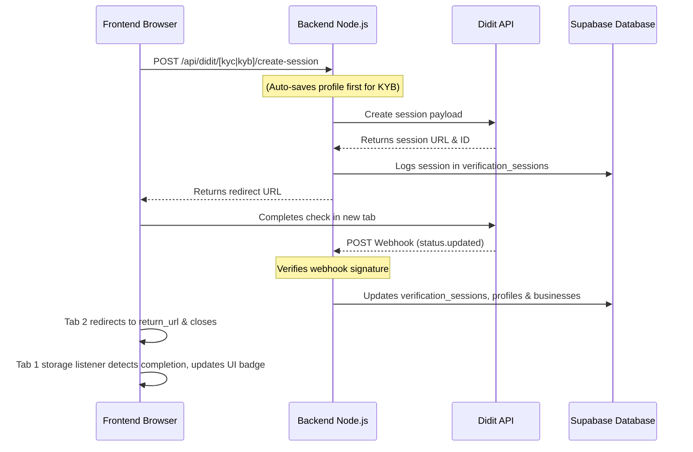

# Didit KYC & KYB Integration Guide

This document provides a comprehensive technical guide to the **Didit Identity (KYC)** and **Business (KYB)** verification integrations in the FundXProut platform. It covers architecture, environment configuration, database schema relationships, backend endpoints, frontend workflows, and local testing setups.

---

## Table of Contents
1. [Architecture & Flow Overview](#1-architecture--flow-overview)
2. [Environment Variables (.env)](#2-environment-variables-env)
3. [Database Schema Relationships](#3-database-schema-relationships)
4. [Backend Implementation Details](#4-backend-implementation-details)
5. [Frontend Implementation Details](#5-frontend-implementation-details)
6. [UX Safety Features](#6-ux-safety-features)
7. [Testing Locally (Webhooks Tunneling)](#7-testing-locally-webhooks-tunneling)

---

## 1. Architecture & Flow Overview

FundXProut leverages **Didit** (v3 SDK/REST API) to automate biometric identity verification (KYC) for investors/creators and business compliance (KYB) for creators. 

The verification flow operates under the following sequence:



---

## 2. Environment Variables (.env)

The integration relies on environment variables configured in both the backend and frontend.

### A. Backend Environment Variables (`backend/.env`)
These keys are crucial for communicating with the Didit REST API and validating incoming webhooks.

```ini
# --- Supabase Database Configuration ---
SUPABASE_URL=https://your-supabase-project.supabase.co
SUPABASE_SERVICE_ROLE_KEY=your-supabase-service-role-key

# --- Didit API Settings ---
DIDIT_API_KEY=your-didit-developer-api-key
DIDIT_KYC_WORKFLOW_ID=your-didit-kyc-workflow-id
DIDIT_KYB_WORKFLOW_ID=your-didit-kyb-workflow-id

# --- Didit Webhook Signature Verification ---
# Generated when you configure the webhook destination in Didit Dashboard
DIDIT_WEBHOOK_SECRET=your-didit-webhook-signing-secret

# --- App Configuration ---
APP_URL=http://localhost:3000
```

### B. Frontend Environment Variables (`frontend/.env.local`)
Ensures the frontend routes request to the correct backend API service.

```ini
NEXT_PUBLIC_API_URL=http://localhost:5000
NEXT_PUBLIC_SUPABASE_URL=https://your-supabase-project.supabase.co
NEXT_PUBLIC_SUPABASE_ANON_KEY=your-supabase-client-anon-key
```

---

## 3. Database Schema Relationships

To ensure proper state tracking and verification fallback logs, the integration relies on the following relational tables in Supabase:

### `profiles` (User Profiles)
- `user_id` (UUID, Primary Key)
- `identity_verified` (Boolean): Set to `true` upon KYC completion. Only updated by the backend.

### `businesses` (Business Accounts)
- `id` (UUID, Primary Key)
- `owner_id` (UUID, Foreign Key referencing `profiles.user_id`)
- `business_name` (Text)
- `kyb_verified` (Boolean): Set to `true` upon KYB completion.

### `verification_sessions` (Audit Log of Didit Sessions)
- `didit_session_id` (Text, Unique Primary Key): Didit session reference (e.g. `session_id`).
- `entity_type` (Text): `'user'` or `'business'`.
- `entity_id` (UUID): Reference to either `profiles.user_id` or `businesses.id`.
- `session_kind` (Text): `'KYC'` or `'KYB'`.
- `status` (Text): e.g. `'Created'`, `'Approved'`, `'Pending'`, `'Declined'`.
- `decision` (Text): Detailed verification decision payload.
- `created_at` / `updated_at` (Timestamps).

---

## 4. Backend Implementation Details

All backend routes reside in [`backend/routes/diditRoutes.js`](file:///e:/FYP/fundxprout/backend/routes/diditRoutes.js) and are mounted under `/api/didit`.

### 1. Webhook Signature Validation
To prevent spoofing, webhooks are checked against the `DIDIT_WEBHOOK_SECRET` using HMAC SHA256:
- Incoming requests require the headers `X-Signature-V2` and `X-Timestamp`.
- A raw request body signature check is performed *prior* to parsing the JSON payload.

### 2. Session Creation API
- **KYC (`POST /kyc/create-session`)**: Requires `userId`. Fetches a session token from Didit and links the returned `session_id` to the user in `verification_sessions`.
- **KYB (`POST /kyb/create-session`)**: Requires `userId`. Finds the linked `business` ID first, then creates a KYB session, passing `business.id` as the `vendor_data`.

### 3. Verification Sync Fallback (`POST /sync-status`)
If local network tunnels break or webhooks fail to deliver, the frontend polls this endpoint:
- It fetches the latest session ID from `verification_sessions` for the user.
- It triggers a direct REST fetch request to Didit API (`https://verification.didit.me/v3/session/{session_id}/`).
- If Didit reports `'Approved'`, the backend directly updates `profiles` or `businesses` in Supabase.

---

## 5. Frontend Implementation Details

The frontend logic resides in [`frontend/app/profile/page.jsx`](file:///e:/FYP/fundxprout/frontend/app/profile/page.jsx).

### 1. State Separation
To prevent both KYC and KYB buttons from locking or showing loading screens simultaneously:
- A string-based status state is used: `const [verifying, setVerifying] = useState(null);` (which can be `'kyc'`, `'kyb'`, or `null`).
- Disabled/Loading indicators are scoped specifically to the matching key: `disabled={verifying === 'kyc'}` or `disabled={verifying === 'kyb'}`.

### 2. URL Return Callbacks (`useEffect`)
When Didit redirects back with query parameters (`status=Approved` or `kyc=complete` / `kyb=complete`), the React layout:
1. Immediately writes verification updates (`identity_verified: true` or `kyb_verified: true`) to Supabase.
2. Broadcasts a completion token to `localStorage` to synchronize other tabs.
3. Automatically triggers `window.close()` to close itself if it was opened as a child window/popup.

---

## 6. UX Safety Features

### A. Auto-Saving Business Profile (KYB Fallback)
For KYB to initialize, Didit requires a valid Business ID from Supabase. If a creator attempts to start verification without saving their profile details first:
- The frontend detects that no `business` row exists.
- It intercept-saves the form details in the background (`handleSave()`), creating the necessary database relationship.
- It then initiates Didit KYB seamlessly without showing a `400 Create a business profile first` error.

### B. Cross-Tab Synchronization
If a user is verifying using a separate browser window or their mobile phone:
- The main profile tab listens for `storage` change events:
  ```javascript
  window.addEventListener("storage", (e) => {
    if (e.key === "didit_verified_event") {
       // Refresh Supabase profile state and turn button into green checkmark
    }
  });
  ```
- This triggers an instant interface update in any other open profile tab without requiring manual page reloads.

---

## 7. Testing Locally (Webhooks Tunneling)

Since Didit requires a public HTTP endpoint to deliver async webhooks:

1. **Start Local Tunnel**:
   ```bash
   npx cloudflared tunnel --url http://localhost:5000
   ```
2. **Add Destination in Didit Dashboard**:
   Register `https://[YOUR_TUNNEL_URL]/api/didit/webhook` for the `status.updated` event.
3. **Save Webhook Secret**:
   Copy the generated Signing Secret and save it as `DIDIT_WEBHOOK_SECRET` in your backend `.env` file, then restart the server.
